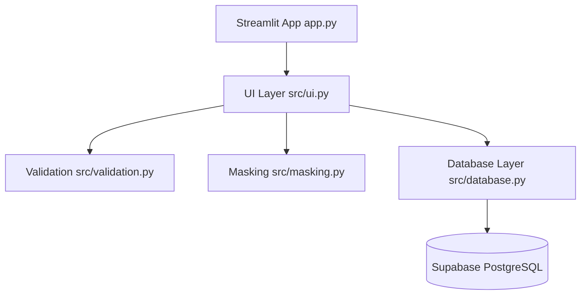

# HDB Resident Records Management System - Architecture & Implementation Plan

## 1. Supabase Database Schema

```sql
CREATE TABLE records (
    id UUID PRIMARY KEY DEFAULT gen_random_uuid(),
    name TEXT NOT NULL,
    nric TEXT NOT NULL,
    nric_masked TEXT NOT NULL,
    unit_number TEXT NOT NULL,
    unit_number_normalized TEXT NOT NULL UNIQUE,
    created_at TIMESTAMPTZ DEFAULT NOW(),
    updated_at TIMESTAMPTZ DEFAULT NOW()
);

-- Index for fast searching on normalized unit numbers and names
CREATE INDEX idx_records_unit_normalized ON records(unit_number_normalized);
CREATE INDEX idx_records_name ON records(name);
```

## 2. Component Architecture & Workflow



### Module Responsibilities:
- [`app.py`](app.py): Main entry point for the Streamlit application with multi-tab or sidebar navigation.
- [`src/database.py`](src/database.py): Supabase client initialization, connection checks, duplicate checking via `unit_number_normalized`, and record insertion/fetching.
- [`src/validation.py`](src/validation.py): Input sanitization, trimming, Singapore NRIC/FIN regex validation (`^[STFG]\d{7}[A-Z]$`), and unit number normalization (e.g., standardizing `#01-101`, `01-101`, `#1-101` to a canonical format).
- [`src/masking.py`](src/masking.py): NRIC privacy protection, masking all but the last 4 characters (e.g., `S1234567A` -> `***4567A`).
- [`src/ui.py`](src/ui.py): Render Streamlit widgets for Adding records, Viewing records list, and Searching records.

## 3. Implementation Steps Todo List

1. Create [`requirements.txt`](requirements.txt) with dependencies (`streamlit`, `supabase`, `python-dotenv`).
2. Create [`src/masking.py`](src/masking.py) for NRIC privacy masking.
3. Create [`src/validation.py`](src/validation.py) for NRIC and unit number validation and normalization.
4. Create [`src/database.py`](src/database.py) for Supabase interaction and uniqueness enforcement.
5. Create [`src/ui.py`](src/ui.py) for UI components (Add, View, Search).
6. Create [`app.py`](app.py) tying everything together.
7. Create [`README.md`](README.md) with complete setup, Supabase schema, Streamlit secrets configuration, and deployment instructions.
